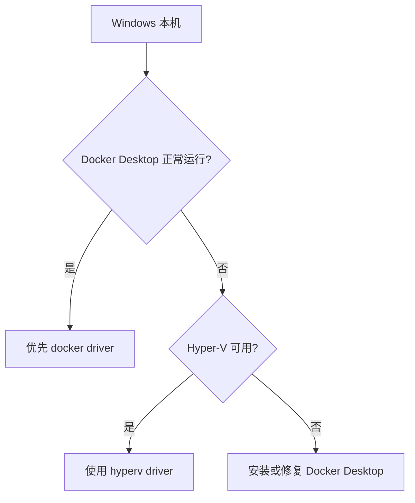

# 00｜环境确认

[← 返回首页](../README.md) · [下一章：集群启动与架构 →](01-cluster-start-and-architecture.md)

## 目标

确认 `minikube`、`kubectl`、容器驱动和本机资源满足实验要求。

## 1. 检查工具

```powershell
minikube version
kubectl version --client
minikube status
```

建议至少准备 2 CPU、4 GB 可用内存；进行 HPA、Ingress 和多个工作负载实验时，推荐给 Minikube 4 CPU、6 GB 内存。

## 2. 查看可用驱动

```powershell
minikube config get driver
minikube start --help
```

Windows 常见选择：



Docker 驱动启动示例：

```powershell
minikube start --driver=docker --cpus=4 --memory=6144
```

## 3. 检查 kubectl 上下文

```powershell
kubectl config current-context
kubectl config get-contexts
```

期待当前上下文为：

```text
minikube
```

必要时切换：

```powershell
kubectl config use-context minikube
```

## 4. 最小连通性确认

```powershell
kubectl cluster-info
kubectl get nodes -o wide
kubectl get pods -A
```

成功标准：

- Node 状态为 `Ready`
- `kube-system` 中 CoreDNS 等核心 Pod 为 `Running`
- `kubectl cluster-info` 能显示控制面地址

## 5. 常见问题

### Docker Desktop 没启动

```text
failed to connect to the docker API
```

先启动 Docker Desktop，等待状态变为 Running，再执行：

```powershell
minikube delete
minikube start --driver=docker --cpus=4 --memory=6144
```

### 资源不足

```powershell
minikube delete
minikube start --driver=docker --cpus=2 --memory=4096
```

## 本章验收

```powershell
kubectl get node
```

看到一个 `Ready` Node 后进入下一章。
