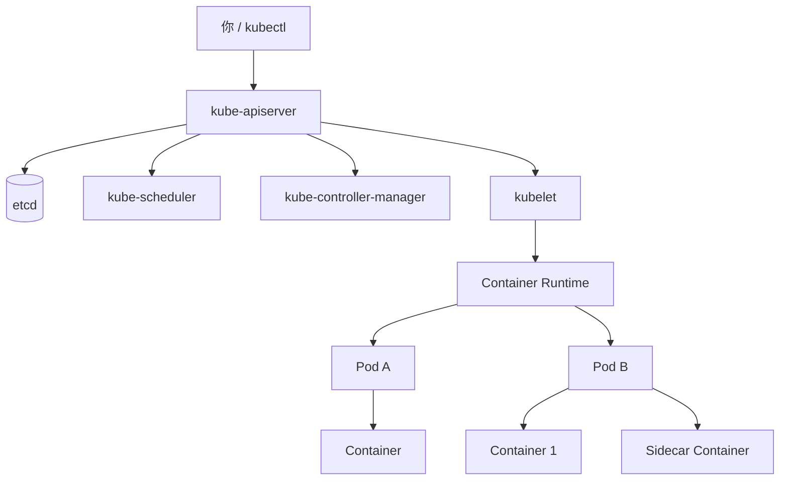
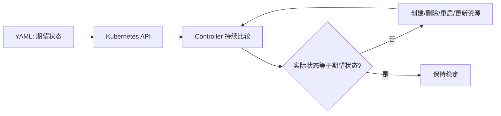

# 01｜启动集群并理解 Kubernetes 架构

[← 上一章](00-environment-check.md) · [首页](../README.md) · [下一章：Namespace →](02-namespace.md)

## 1. 启动 Minikube

```powershell
minikube start --driver=docker --cpus=4 --memory=6144
```

启用后续实验需要的插件：

```powershell
minikube addons enable metrics-server
minikube addons enable ingress
```

查看插件：

```powershell
minikube addons list
```

## 2. Minikube 到底创建了什么



### 用城市来理解

| Kubernetes 概念 | 形象比喻 |
|---|---|
| Cluster | 一座城市 |
| Control Plane | 市政府与调度中心 |
| Node | 一栋可承载业务的大楼 |
| Pod | 一套共享网络与空间的房间 |
| Container | 房间中的工作人员或设备 |
| Deployment | 保证某种房间始终有指定数量的管理处 |
| Service | 不随房间更换而变化的总机号码 |

## 3. 查看核心组件

```powershell
kubectl get nodes -o wide
kubectl get pods -n kube-system -o wide
kubectl get componentstatuses
```

> 某些 Kubernetes 版本中 `componentstatuses` 已不再可靠，主要以 Node 和系统 Pod 状态为准。

## 4. 理解声明式操作

命令式：

```powershell
kubectl create deployment web --image=nginx:1.27
```

声明式：

```powershell
kubectl apply -f deployment.yaml
```



## 5. 打开 Minikube 图形界面

```powershell
minikube dashboard
```

只获取 URL：

```powershell
minikube dashboard --url
```

现在主要观察：

- Cluster / Nodes
- Namespace
- `kube-system` 工作负载

## 本章验收

```powershell
kubectl get nodes
kubectl get pods -A
```

所有核心资源正常后继续。
