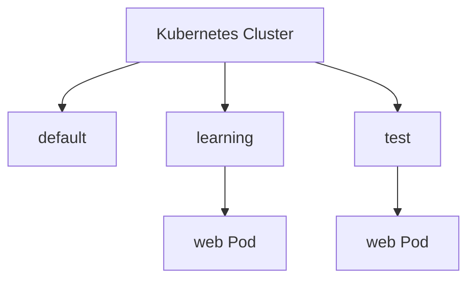
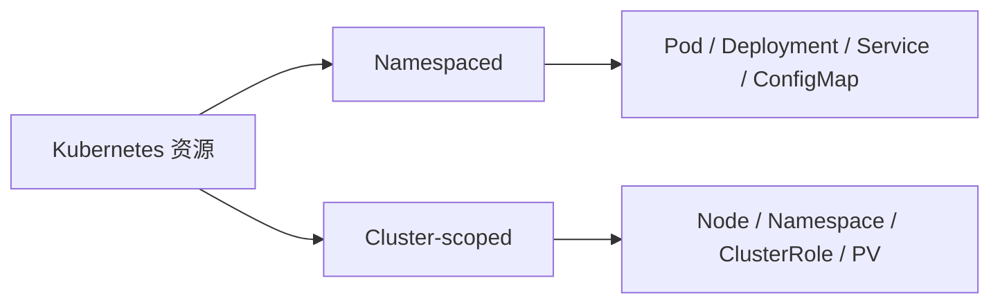

# 02｜Namespace：给资源划分实验空间

[← 上一章](01-cluster-start-and-architecture.md) · [首页](../README.md) · [下一章：Pod →](03-pod.md)

## 概念

Namespace 像同一栋大楼中的不同楼层。不同团队或环境可以使用相同资源名，但彼此隔离。



## 创建学习 Namespace

```powershell
kubectl create namespace learning
kubectl get namespaces
```

设置当前上下文默认 Namespace：

```powershell
kubectl config set-context --current --namespace=learning
kubectl config view --minify | Select-String namespace
```

也可以通过 YAML：

```yaml
apiVersion: v1
kind: Namespace
metadata:
  name: learning
```

## 验证

```powershell
kubectl get all
kubectl get all -n learning
kubectl get all -n default
```

Dashboard 中从顶部 Namespace 下拉框选择 `learning`。

## 重要提醒

并非所有资源都属于 Namespace：



## 本章验收

```powershell
kubectl config view --minify -o jsonpath='{..namespace}'
```

输出 `learning` 即完成。
