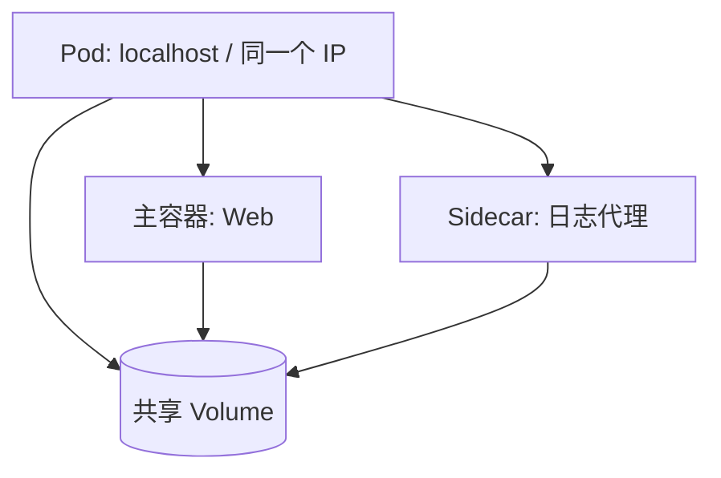
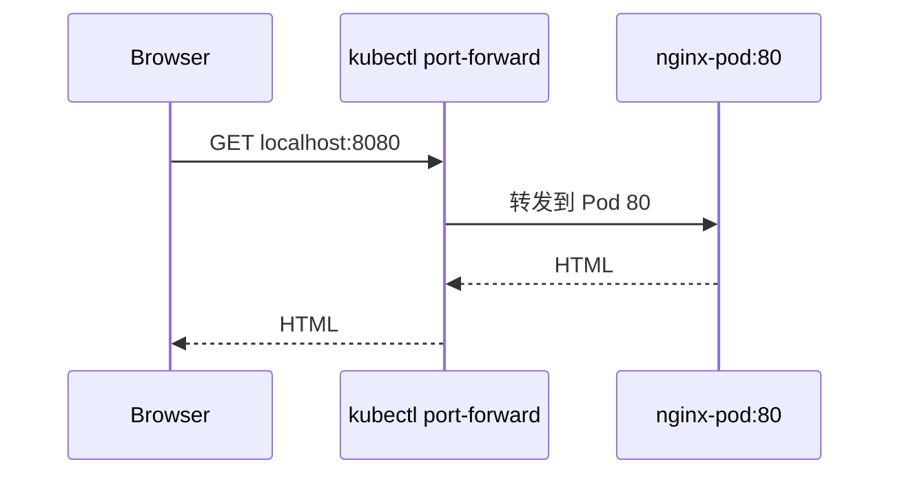

# 03｜Pod：Kubernetes 最小调度单元

[← 上一章](02-namespace.md) · [首页](../README.md) · [下一章：Deployment →](04-deployment.md)

## 1. Pod 不是容器本身

Pod 是一个或多个紧密协作容器的包装层，共享网络和部分存储。



## 2. 创建 Pod

```powershell
kubectl apply -f ../manifests/01-pod/nginx-pod.yaml
kubectl get pods -o wide
kubectl describe pod nginx-pod
```

从项目根目录运行时：

```powershell
kubectl apply -f manifests/01-pod/nginx-pod.yaml
```

## 3. 查看日志和容器内部

```powershell
kubectl logs nginx-pod
kubectl exec -it nginx-pod -- sh
```

容器中执行：

```sh
hostname
cat /usr/share/nginx/html/index.html
exit
```

## 4. 本地访问

```powershell
kubectl port-forward pod/nginx-pod 8080:80
```

浏览器访问 `http://localhost:8080`。



## 5. 删除 Pod 并观察

```powershell
kubectl delete pod nginx-pod
kubectl get pods
```

Pod 不会自动回来，因为它没有控制器管理。这正是下一章 Deployment 的价值。

## Dashboard 检查

进入 `Workloads → Pods`：

- 名称 `nginx-pod`
- Namespace `learning`
- 状态 `Running`
- 查看 Logs、Events、YAML

## 本章验收

能够解释：Pod 可以包含多个容器，但通常一个 Pod 放一个主业务容器；多个容器只有在生命周期和网络必须紧密绑定时才放在一起。
