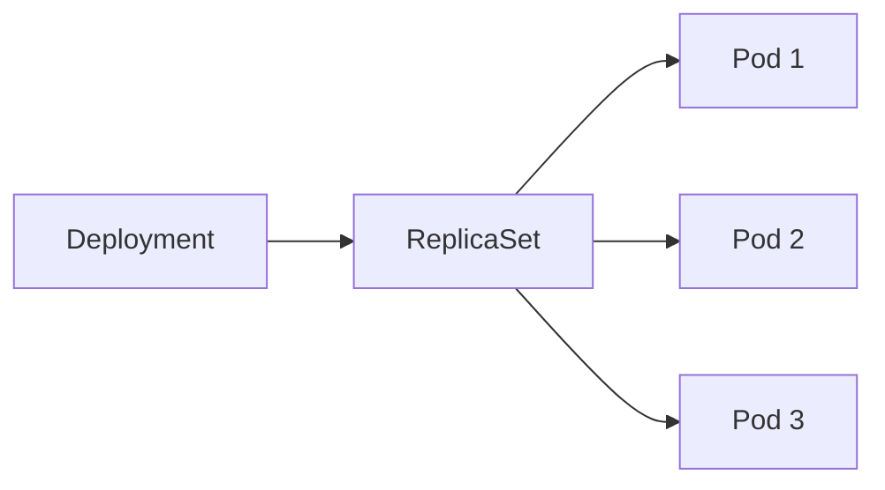
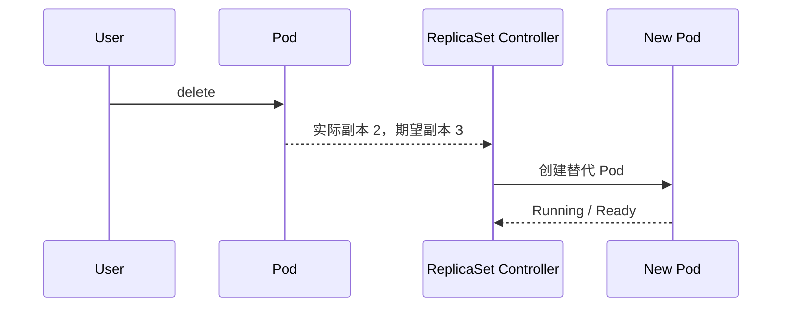
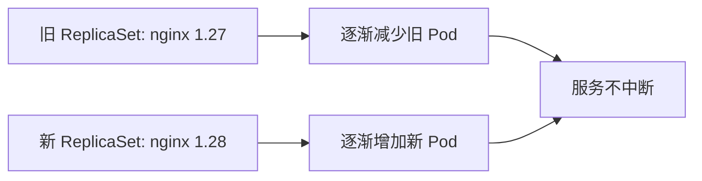

# 04｜Deployment：副本、自恢复、滚动更新与回滚

[← 上一章](03-pod.md) · [首页](../README.md) · [下一章：Service →](05-service.md)

## 1. 控制器关系



Deployment 管理 ReplicaSet，ReplicaSet 保证 Pod 数量满足期望值。

## 2. 创建 Deployment

```powershell
kubectl apply -f manifests/02-deployment/web-deployment.yaml
kubectl get deployments
kubectl get replicasets
kubectl get pods -l app=web -o wide
```

## 3. 验证自恢复

先持续观察：

```powershell
kubectl get pods -l app=web -w
```

另开终端删除一个 Pod：

```powershell
kubectl delete pod -l app=web --field-selector=status.phase=Running --wait=false
```

更稳妥地删除指定 Pod：

```powershell
$pod = kubectl get pod -l app=web -o jsonpath='{.items[0].metadata.name}'
kubectl delete pod $pod
```

你会看到旧 Pod 消失，新 Pod 被 ReplicaSet 创建。



## 4. 手动扩缩容

```powershell
kubectl scale deployment web --replicas=5
kubectl get pods -l app=web
kubectl scale deployment web --replicas=3
```

## 5. 滚动更新

```powershell
kubectl set image deployment/web nginx=nginx:1.28
kubectl rollout status deployment/web
kubectl rollout history deployment/web
```



## 6. 制造错误并回滚

```powershell
kubectl set image deployment/web nginx=nginx:not-exist
kubectl rollout status deployment/web --timeout=60s
kubectl get pods
kubectl describe pod -l app=web
```

回滚：

```powershell
kubectl rollout undo deployment/web
kubectl rollout status deployment/web
```

## Dashboard 检查

`Workloads → Deployments → web`：

- Desired / Current / Available Replicas
- ReplicaSet 历史
- Pod Events
- Image 版本

## 本章验收

```powershell
kubectl get deploy web
```

`READY` 应为 `3/3`。
