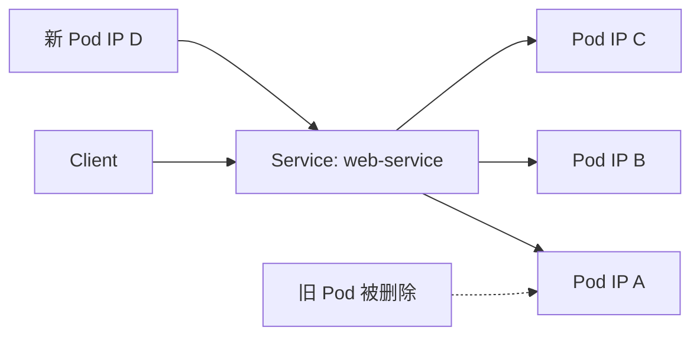
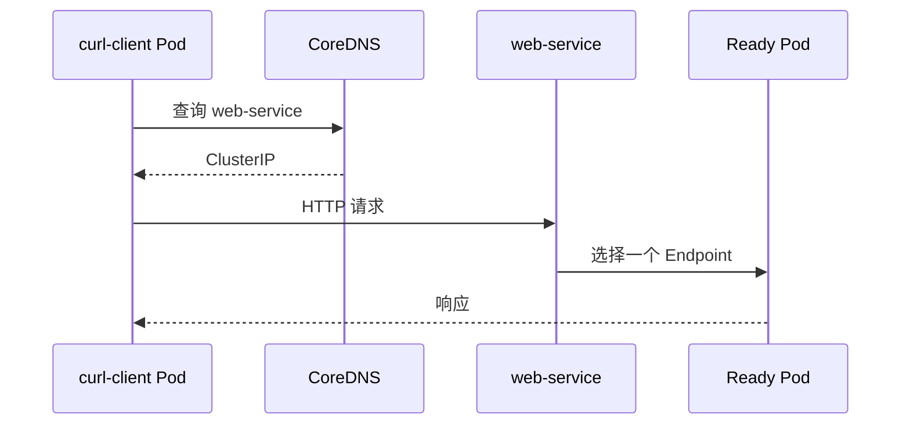

# 05｜Service：给变化的 Pod 提供稳定入口

[← 上一章](04-deployment.md) · [首页](../README.md) · [下一章：ConfigMap 与 Secret →](06-configmap-secret.md)

## 1. 为什么需要 Service

Pod 会被替换，IP 也会变化。Service 使用标签选择器找到当前健康 Pod，并提供稳定虚拟 IP 和 DNS 名称。



## 2. 创建 ClusterIP Service

```powershell
kubectl apply -f manifests/03-service/web-service.yaml
kubectl get services
kubectl get endpointslices -l kubernetes.io/service-name=web-service
```

确认 selector：

```powershell
kubectl describe service web-service
```

## 3. 访问 Service

```powershell
kubectl port-forward service/web-service 8080:80
```

浏览器访问 `http://localhost:8080`。

Minikube 也可以：

```powershell
minikube service web-service --url -n learning
```

## 4. 集群内部 DNS

创建临时客户端：

```powershell
kubectl run curl-client --image=curlimages/curl:8.10.1 --restart=Never -- sleep 3600
kubectl exec curl-client -- curl -s http://web-service
```

完整 DNS：

```text
web-service.learning.svc.cluster.local
```



## 5. Service 类型

| 类型 | 用途 |
|---|---|
| ClusterIP | 仅集群内部访问，默认类型 |
| NodePort | 通过 Node IP + 高端口访问 |
| LoadBalancer | 云平台创建外部负载均衡器；Minikube 可用 `minikube tunnel` 模拟 |
| ExternalName | 用 DNS CNAME 映射外部名称 |

## Dashboard 检查

`Service → Services → web-service`，确认 Selector、ClusterIP、Port 与 Endpoint。

## 本章验收

删除任意 web Pod 后，继续访问 Service，服务仍应恢复可用。
