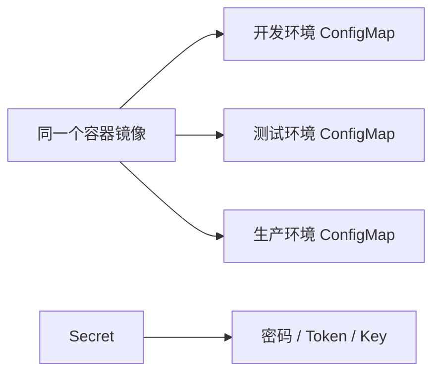
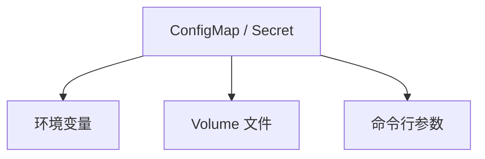

# 06｜ConfigMap 与 Secret：让镜像和环境配置分离

[← 上一章](05-service.md) · [首页](../README.md) · [下一章：存储 →](07-storage.md)

## 思路



## 1. 创建 ConfigMap 和 Secret

```powershell
kubectl apply -f manifests/04-config/app-config.yaml
kubectl apply -f manifests/04-config/app-secret.yaml
kubectl apply -f manifests/04-config/config-demo-pod.yaml
```

查看：

```powershell
kubectl get configmap app-config -o yaml
kubectl get secret app-secret -o yaml
kubectl exec config-demo -- env | Select-String 'APP_|DB_'
```

## 2. 文件挂载与环境变量

ConfigMap / Secret 常见注入方式：



环境变量方式通常需要重建 Pod 才读取新值；Volume 文件更新可能会延迟同步，但应用本身还需要支持重新读取。

## 3. Secret 不是加密保险箱

Secret 默认只是 Base64 编码；是否静态加密取决于集群配置。不要把真实生产密码提交到 GitHub。

解码实验值：

```powershell
$encoded = kubectl get secret app-secret -o jsonpath='{.data.DB_PASSWORD}'
[Text.Encoding]::UTF8.GetString([Convert]::FromBase64String($encoded))
```

## Dashboard 检查

- `Config and Storage → Config Maps`
- `Config and Storage → Secrets`
- Pod 的 Environment 与 Volumes

## 本章验收

```powershell
kubectl logs config-demo
kubectl exec config-demo -- cat /config/app.properties
```
