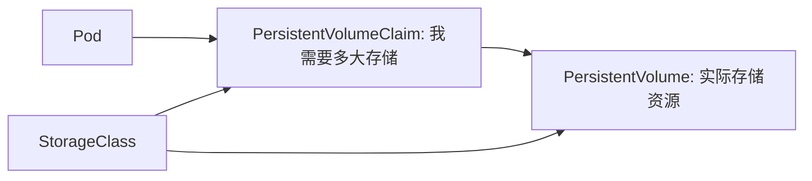
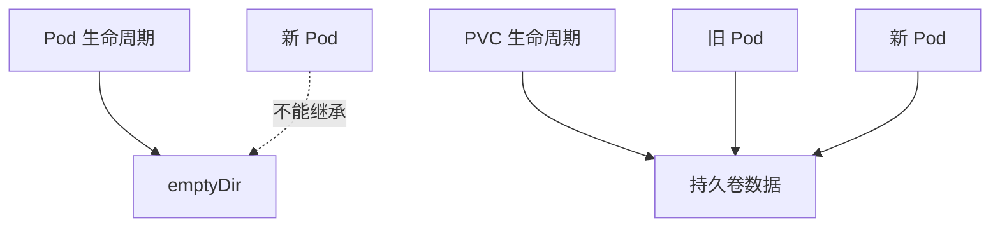

# 07｜Volume、PersistentVolume 与 PersistentVolumeClaim

[← 上一章](06-configmap-secret.md) · [首页](../README.md) · [下一章：健康检查 →](08-probes.md)

## 1. 三层关系



- Volume：Pod 内可用的存储挂载概念
- PVC：应用提出存储需求
- PV：集群提供的存储资源
- StorageClass：动态创建存储的模板

## 2. 查看 Minikube 存储能力

```powershell
kubectl get storageclass
kubectl get pv
kubectl get pvc
```

## 3. 创建 PVC 与 Pod

```powershell
kubectl apply -f manifests/05-storage/pvc.yaml
kubectl apply -f manifests/05-storage/pvc-demo-pod.yaml
kubectl get pvc,pv
```

写入文件：

```powershell
kubectl exec pvc-demo -- sh -c "date >> /data/history.txt"
kubectl exec pvc-demo -- cat /data/history.txt
```

删除并重建 Pod：

```powershell
kubectl delete pod pvc-demo
kubectl apply -f manifests/05-storage/pvc-demo-pod.yaml
kubectl exec pvc-demo -- cat /data/history.txt
```

数据仍在，说明生命周期不再绑定到单个 Pod。

## 4. emptyDir 对比



## Dashboard 检查

查看 PVC 的 `Status=Bound`、容量、StorageClass，再打开 Pod 查看挂载路径 `/data`。

## 本章验收

Pod 被删除重建后，`history.txt` 内容仍然存在。
