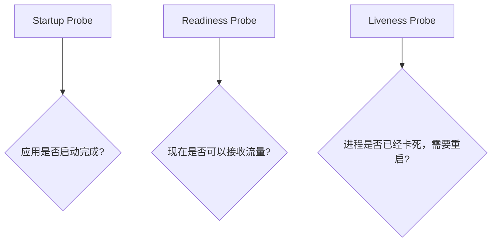
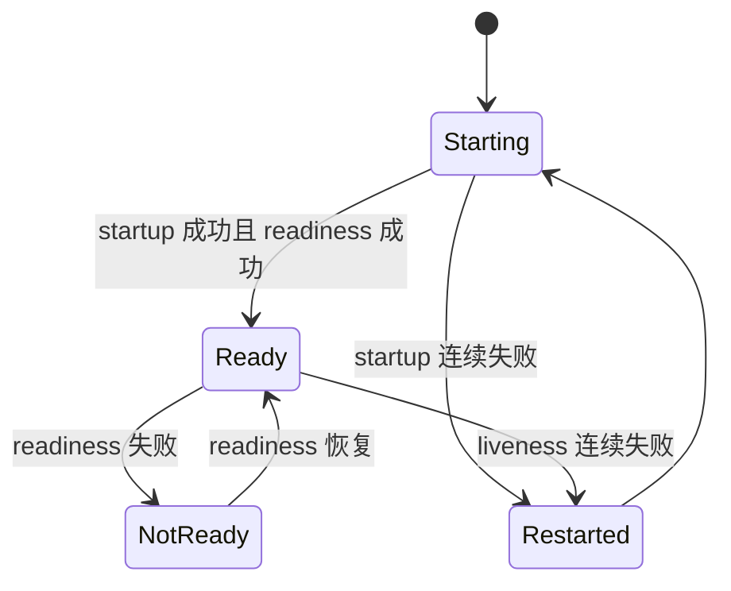

# 08｜Startup、Readiness 与 Liveness Probe

[← 上一章](07-storage.md) · [首页](../README.md) · [下一章：资源管理 →](09-resources.md)

## 三种探针分别回答什么



| 探针 | 失败结果 |
|---|---|
| startupProbe | 启动阶段继续等待；超过阈值后重启容器 |
| readinessProbe | Pod 从 Service Endpoint 中移除，不一定重启 |
| livenessProbe | kubelet 重启容器 |

## 创建实验

```powershell
kubectl apply -f manifests/06-probes/probe-demo.yaml
kubectl get pods -l app=probe-demo -w
```

查看细节：

```powershell
kubectl describe pod -l app=probe-demo
kubectl get endpointslices -l kubernetes.io/service-name=probe-demo
```

## 观察流程



## 主动制造 Liveness 失败

```powershell
$pod = kubectl get pod -l app=probe-demo -o jsonpath='{.items[0].metadata.name}'
kubectl exec $pod -- rm -f /usr/share/nginx/html/healthy
kubectl get pod $pod -w
```

观察 `RESTARTS` 增加。

## Dashboard 检查

Pod 详情中查看：

- Conditions
- Container Restart Count
- Events 中的 Unhealthy / Killing

## 本章验收

能够解释：Readiness 失败是“暂时不接客”，Liveness 失败是“员工卡死，需要重启”。
