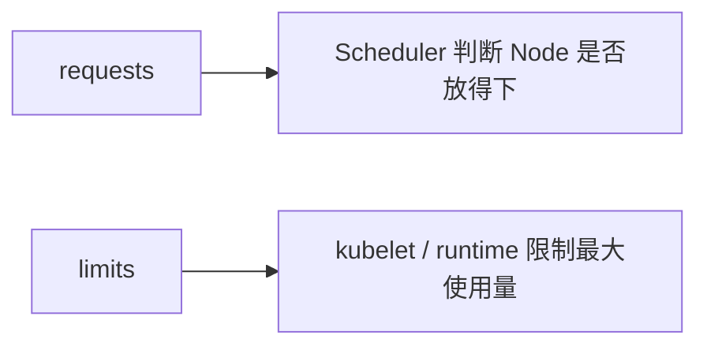
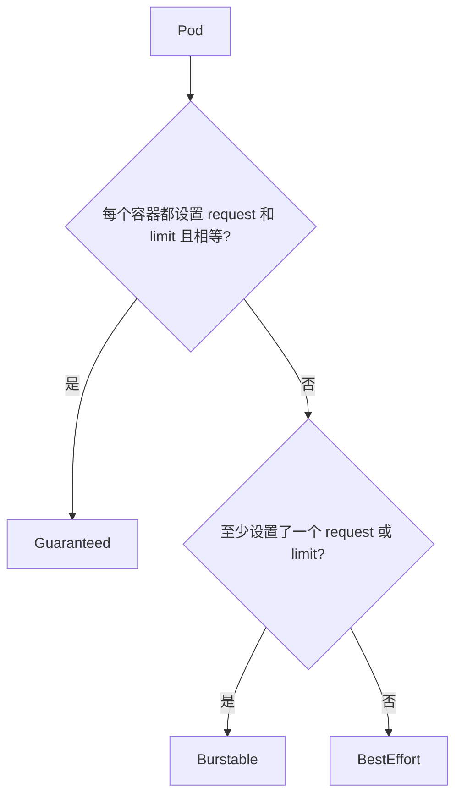

# 09｜CPU、内存 Requests / Limits 与 QoS

[← 上一章](08-probes.md) · [首页](../README.md) · [下一章：HPA →](10-hpa.md)

## 1. 调度与限制



- CPU request：调度时保留的计算能力
- CPU limit：允许使用的上限，超过时可能被节流
- Memory request：调度参考
- Memory limit：超过时容器可能 OOMKilled

## 2. 创建资源实验

```powershell
kubectl apply -f manifests/07-resources/resource-demo.yaml
kubectl get pod resource-demo
kubectl describe pod resource-demo
kubectl top pod resource-demo
kubectl top nodes
```

如 `kubectl top` 暂时无数据：

```powershell
minikube addons enable metrics-server
kubectl get pods -n kube-system | Select-String metrics
```

## 3. QoS 类别



查看 QoS：

```powershell
kubectl get pod resource-demo -o jsonpath='{.status.qosClass}'
```

## Dashboard / Headlamp 检查

观察 Pod CPU、内存指标和资源配置。指标出现通常需要等待几十秒。

## 本章验收

能区分“调度依据”和“运行上限”，并理解内存 limit 不是温和限速，而可能导致 OOMKill。
