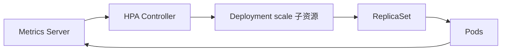
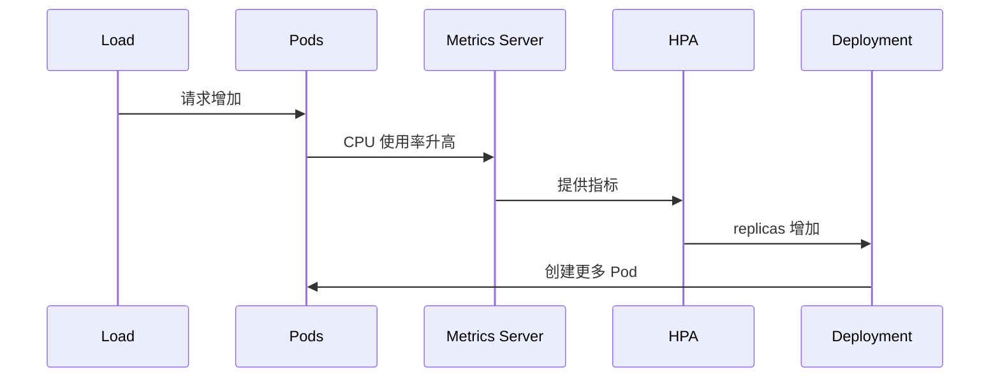

# 10｜HPA：根据指标自动扩缩容

[← 上一章](09-resources.md) · [首页](../README.md) · [下一章：Ingress →](11-ingress.md)

## 工作原理



简化理解：

```text
期望副本数 ≈ 当前副本数 × 当前指标 / 目标指标
```

## 1. 确认 Metrics Server

```powershell
minikube addons enable metrics-server
kubectl top nodes
```

## 2. 创建应用、Service 与 HPA

```powershell
kubectl apply -f manifests/08-hpa/
kubectl get deploy,svc,hpa
```

持续观察：

```powershell
kubectl get hpa -w
```

## 3. 制造负载

另开终端：

```powershell
kubectl run load-generator --image=busybox:1.36 --restart=Never -- /bin/sh -c "while true; do wget -q -O- http://php-apache; done"
```

观察：

```powershell
kubectl get hpa
kubectl get pods -l run=php-apache
```

停止负载：

```powershell
kubectl delete pod load-generator
```

缩容有稳定窗口，不会立刻降下来。



## Dashboard / Headlamp 检查

查看 HPA 当前指标、目标值、最小/最大副本和 Deployment 副本变化。

## 常见失败

`TARGETS` 显示 `<unknown>`：

- Metrics Server 尚未准备好
- Pod 没有设置 CPU request
- 指标采集需要等待

## 本章验收

在负载下看到副本数从 1 增加，停止负载后最终回落。
