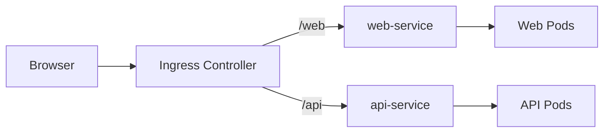
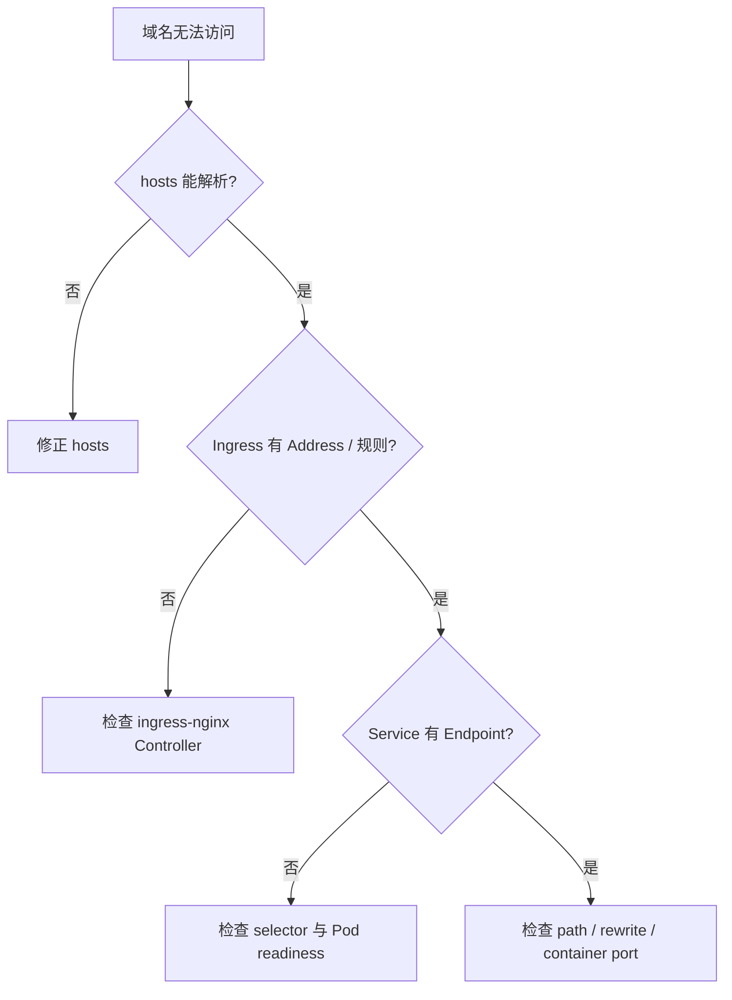

# 11｜Ingress：用域名和路径统一访问多个 Service

[← 上一章](10-hpa.md) · [首页](../README.md) · [下一章：RBAC →](12-rbac.md)

## 网络层次



Ingress 对象只是规则，真正执行规则的是 Ingress Controller。

## 1. 启用插件

```powershell
minikube addons enable ingress
kubectl get pods -n ingress-nginx
```

## 2. 应用示例

```powershell
kubectl apply -f manifests/09-ingress/
kubectl get ingress
kubectl describe ingress learning-ingress
```

## 3. Windows 访问方式

获取 IP：

```powershell
minikube ip
```

管理员权限编辑：

```text
C:\Windows\System32\drivers\etc\hosts
```

追加：

```text
<MINIKUBE_IP> learning.local
```

访问：

```text
http://learning.local/web
http://learning.local/api
```

Docker driver 在部分 Windows 网络环境下可能无法直接访问 Minikube IP，可使用：

```powershell
minikube tunnel
```

或者使用端口转发验证 Service。

## 4. 排错链路



## Dashboard 检查

查看 Ingress 的 Host、Path、Backend Service 与 Events。

## 本章验收

两个 URL 分别进入不同后端服务。
