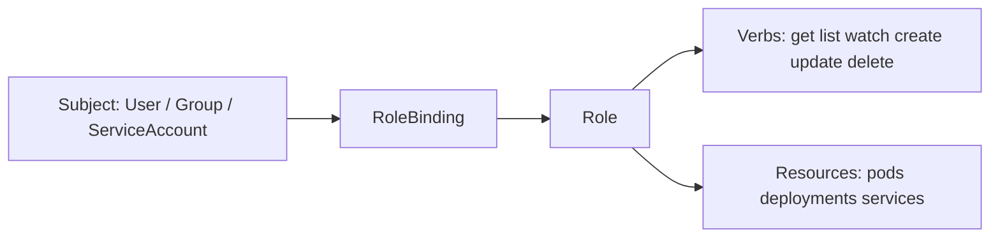
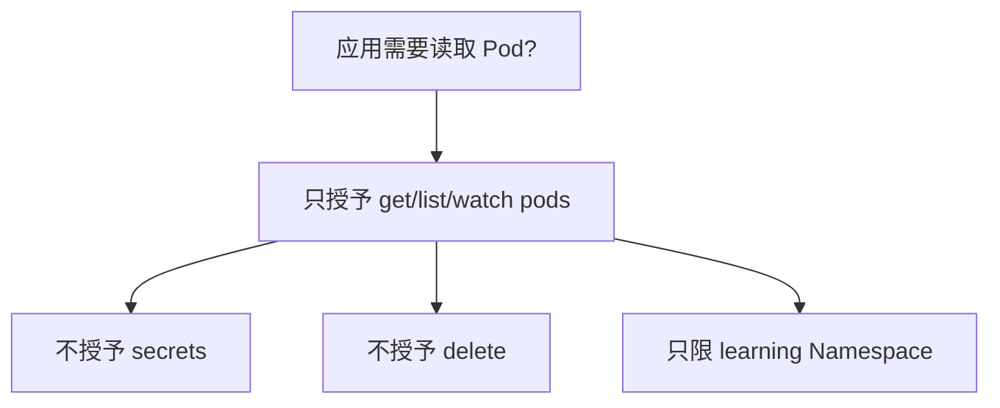

# 12｜ServiceAccount 与 RBAC：谁可以对什么做什么

[← 上一章](11-ingress.md) · [首页](../README.md) · [下一章：Job 与 CronJob →](13-job-cronjob.md)

## 权限模型



- Role：某个 Namespace 内的权限规则
- ClusterRole：集群范围或可复用的权限规则
- RoleBinding：把 Role/ClusterRole 绑定到主体
- ClusterRoleBinding：在整个集群绑定

## 创建只读 ServiceAccount

```powershell
kubectl apply -f manifests/10-rbac/pod-reader.yaml
```

验证权限：

```powershell
kubectl auth can-i list pods --as=system:serviceaccount:learning:pod-reader -n learning
kubectl auth can-i delete pods --as=system:serviceaccount:learning:pod-reader -n learning
kubectl auth can-i list secrets --as=system:serviceaccount:learning:pod-reader -n learning
```

期待：

```text
yes
no
no
```

## 最小权限原则



## Dashboard 管理员示例的风险

本地学习有时会创建 `cluster-admin` ServiceAccount 登录 UI，但它拥有近乎完全控制权。只可用于个人临时实验，完成后立即删除。

## 本章验收

能用 `kubectl auth can-i` 证明“允许读取 Pod，但不能删除 Pod 和读取 Secret”。
