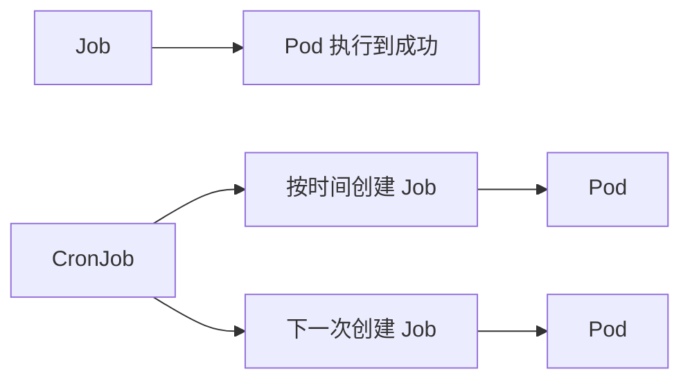

# 13｜Job 与 CronJob：一次性任务和定时任务

[← 上一章](12-rbac.md) · [首页](../README.md) · [下一章：StatefulSet →](14-statefulset.md)

## 概念



Deployment 希望 Pod 长期运行；Job 希望任务成功完成后结束。

## 创建

```powershell
kubectl apply -f manifests/11-jobs/job.yaml
kubectl apply -f manifests/11-jobs/cronjob.yaml
kubectl get jobs,cronjobs,pods
```

查看日志：

```powershell
kubectl logs job/pi
kubectl get jobs -w
```

手动触发 CronJob：

```powershell
kubectl create job --from=cronjob/hello-cron hello-now
kubectl logs job/hello-now
```

## 并发策略

| concurrencyPolicy | 含义 |
|---|---|
| Allow | 允许上一次未结束时再次运行 |
| Forbid | 上一次未结束则跳过 |
| Replace | 用新任务替换旧任务 |

## Dashboard 检查

查看 Job 的 Completion、Pod Logs、CronJob Schedule 与最近执行时间。

## 本章验收

`pi` Job 显示 `Complete`，手动触发的 `hello-now` 有日志输出。
