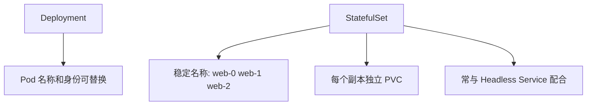
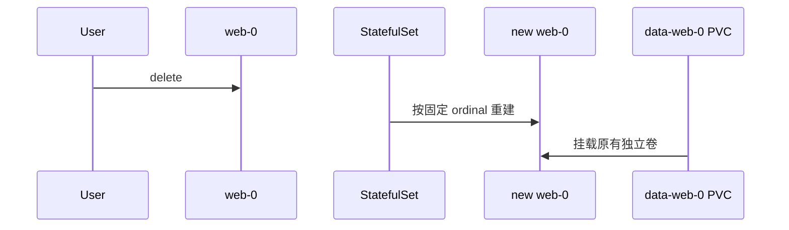

# 14｜StatefulSet：稳定身份、顺序与独立存储

[← 上一章](13-job-cronjob.md) · [首页](../README.md) · [下一章：DaemonSet →](15-daemonset.md)

## Deployment 与 StatefulSet



适合数据库、消息系统等需要稳定网络身份或独立存储的应用。但使用 StatefulSet 不等于自动获得数据库高可用，应用本身仍需支持复制、选主和恢复。

## 创建示例

```powershell
kubectl apply -f manifests/12-statefulset/
kubectl get statefulset,pods,pvc
```

查看稳定 DNS：

```text
web-0.nginx.learning.svc.cluster.local
web-1.nginx.learning.svc.cluster.local
```

删除 `web-0`：

```powershell
kubectl delete pod web-0
kubectl get pods -w
```

新 Pod 仍叫 `web-0`，并重新挂载自己的 PVC。



## Dashboard 检查

观察 StatefulSet 副本、Pod ordinal、PVC 名称和 Events。

## 本章验收

删除 `web-0` 后，名称与 PVC 绑定关系保持稳定。
