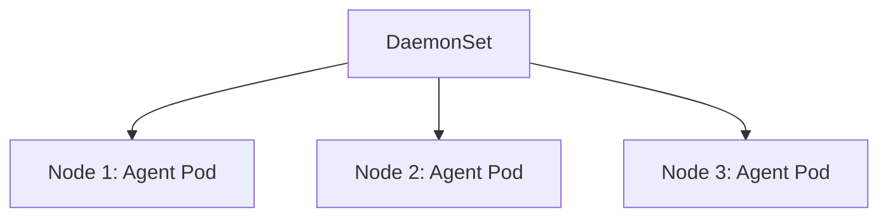

# 15｜DaemonSet：让每个 Node 都运行一个 Pod

[← 上一章](14-statefulset.md) · [首页](../README.md) · [下一章：NetworkPolicy →](16-networkpolicy.md)

## 使用场景

- 日志采集代理
- 节点监控 Agent
- 网络插件
- 安全 Agent



## 创建

```powershell
kubectl apply -f manifests/13-daemonset/node-agent.yaml
kubectl get daemonset
kubectl get pods -l app=node-agent -o wide
```

单节点 Minikube 通常只会看到一个 Pod。

## 多节点扩展实验

可另建一个多节点 profile：

```powershell
minikube start -p multinode --nodes=3 --driver=docker --cpus=2 --memory=3072
kubectl config use-context multinode
kubectl create namespace learning
kubectl apply -n learning -f manifests/13-daemonset/node-agent.yaml
kubectl get pods -n learning -o wide
```

实验后切回：

```powershell
kubectl config use-context minikube
```

## 与 Deployment 区别

| Deployment | DaemonSet |
|---|---|
| 目标是指定副本数 | 目标是符合条件的每个 Node 一个 Pod |
| 适合业务应用 | 适合节点级 Agent |

## 本章验收

DaemonSet 的 `DESIRED` 数量应与符合调度条件的 Node 数一致。
