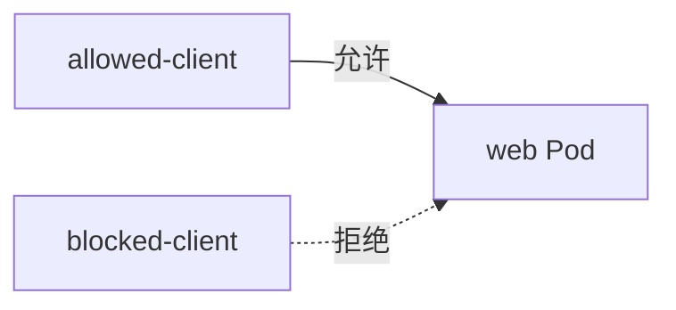
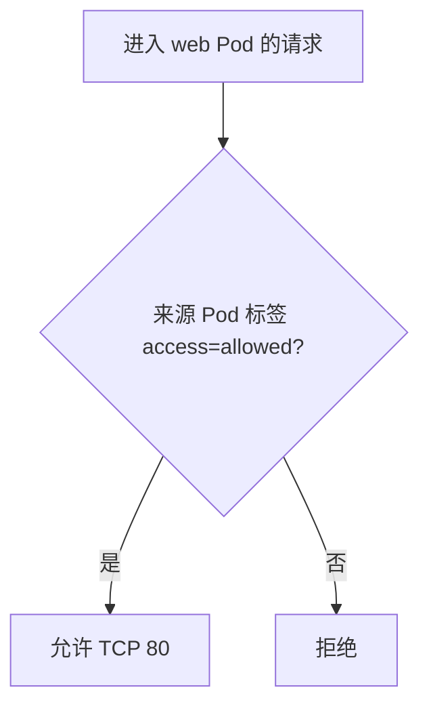

# 16｜NetworkPolicy：限制 Pod 间网络通信

[← 上一章](15-daemonset.md) · [首页](../README.md) · [下一章：Dashboard / Headlamp →](17-dashboard-headlamp.md)

## 默认网络模型

在没有策略时，Pod 通常可以彼此通信。NetworkPolicy 用标签选择 Pod，并规定允许的 Ingress / Egress。



## 重要前提

NetworkPolicy 必须由支持它的 CNI 网络插件执行。某些 Minikube 默认网络配置不会真正阻断流量。

可创建使用 Calico 的独立 profile：

```powershell
minikube start -p policy-lab --driver=docker --network-plugin=cni --cni=calico
```

## 创建实验

```powershell
kubectl apply -f manifests/14-networkpolicy/
```

策略前测试：

```powershell
kubectl exec allowed-client -- wget -qO- --timeout=3 http://network-web
kubectl exec blocked-client -- wget -qO- --timeout=3 http://network-web
```

应用策略后，只有带 `access=allowed` 标签的客户端可访问。



## 验证策略是否被执行

```powershell
kubectl get networkpolicy
kubectl describe networkpolicy allow-labeled-clients
```

如果 blocked-client 仍能访问，通常不是 YAML 无效，而是当前 CNI 不执行 NetworkPolicy。

## 本章验收

理解 NetworkPolicy 是“允许列表”，并能识别 CNI 支持是生效前提。
