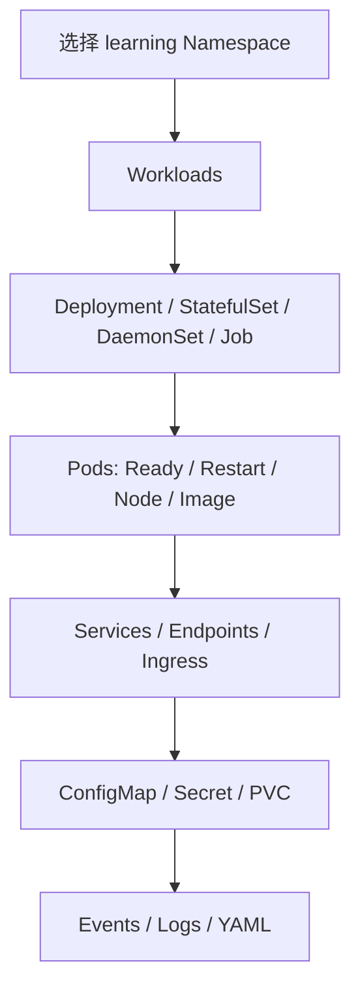
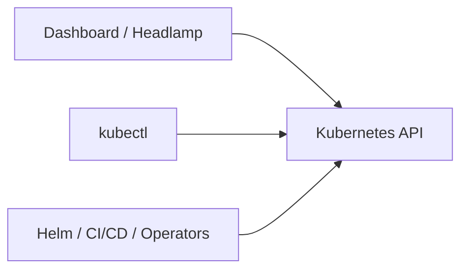

# 17｜在 Dashboard 与 Headlamp 中确认资源

[← 上一章](16-networkpolicy.md) · [首页](../README.md) · [下一章：综合实验 →](18-capstone-lab.md)

## 2026 年的重要变化

原 Kubernetes Dashboard 项目已经归档。学习环境可以继续使用 Minikube 自带的 Dashboard 启动方式，但长期建议熟悉 Headlamp 等仍在维护的 UI。

## 路线 A：Minikube Dashboard

```powershell
minikube dashboard
```

只获取 URL：

```powershell
minikube dashboard --url
```

如果插件未启用：

```powershell
minikube addons enable dashboard
minikube addons enable metrics-server
```

## 路线 B：Headlamp

```powershell
minikube addons enable headlamp
minikube addons enable metrics-server
minikube service headlamp -n headlamp --url
```

查看插件实际创建的资源：

```powershell
kubectl get all -n headlamp
kubectl get serviceaccount,secrets -n headlamp
```

若页面要求 Token，可根据当前插件创建的 ServiceAccount/Secret 获取；不同插件版本资源名可能变化，先执行：

```powershell
kubectl get serviceaccount -n headlamp
kubectl get secret -n headlamp
```

## UI 检查清单



对每个资源至少检查：

1. YAML 中的期望状态
2. Status 中的实际状态
3. Events 中控制器做过什么
4. Pod Logs 中应用发生什么
5. Labels 与 Selector 是否匹配

## 为什么不能只学 UI



UI 和 kubectl 最终都调用 Kubernetes API。生产自动化主要依赖 YAML、GitOps、Helm 和 API，而不是手工点击。

## 本章验收

在 UI 中找到 `learning` Namespace，打开 `web` Deployment，确认副本、Pod、Service、Events 和 YAML。
