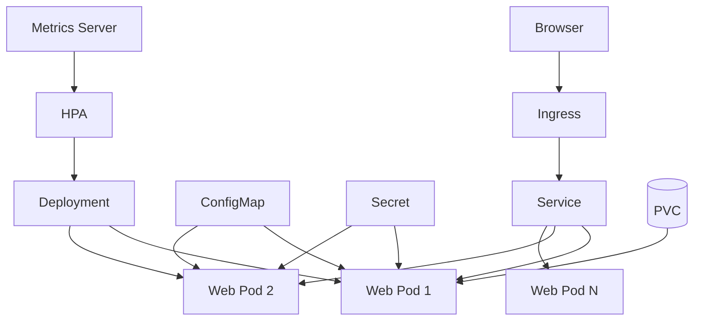

# 18｜综合实验：搭建一个可扩缩、可配置、可观察的 Web 应用

[← 上一章](17-dashboard-headlamp.md) · [首页](../README.md) · [下一章：故障排查与清理 →](19-troubleshooting-cleanup.md)

## 最终架构



## 阶段 1：创建

```powershell
kubectl config set-context --current --namespace=learning
kubectl apply -f manifests/04-config/
kubectl apply -f manifests/05-storage/pvc.yaml
kubectl apply -f manifests/02-deployment/web-deployment.yaml
kubectl apply -f manifests/03-service/web-service.yaml
kubectl apply -f manifests/09-ingress/
```

> 部分示例资源是独立教学用途，名称可能不同。综合实验重点是自己根据前面章节把配置、探针和资源字段加入 Deployment。

## 阶段 2：验证资源链

```powershell
kubectl get deploy,rs,pod,svc,ingress,cm,secret,pvc
kubectl get endpointslices
kubectl get events --sort-by=.lastTimestamp
```

## 阶段 3：自恢复实验

```powershell
$pod = kubectl get pod -l app=web -o jsonpath='{.items[0].metadata.name}'
kubectl delete pod $pod
kubectl get pods -l app=web -w
```

记录：删除前 Pod 名、删除后新 Pod 名、恢复时间、Service 是否中断。

## 阶段 4：滚动升级与回滚

```powershell
kubectl set image deployment/web nginx=nginx:1.28
kubectl rollout status deployment/web
kubectl set image deployment/web nginx=nginx:not-found
kubectl rollout status deployment/web --timeout=45s
kubectl rollout undo deployment/web
```

## 阶段 5：在 UI 中复核

- Deployment 副本变化
- ReplicaSet 历史
- Pod Image 与 Restart Count
- Service Endpoint
- Ingress Backend
- Events 中的拉取失败和回滚结果

## 完成标准


