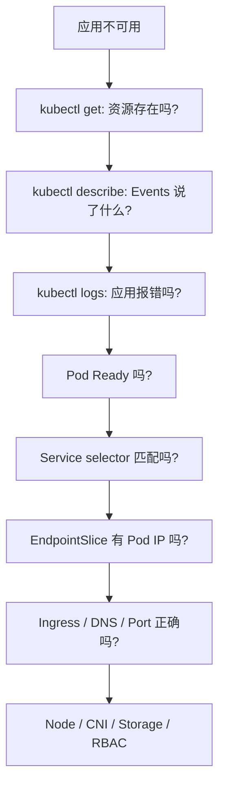

# 19｜故障排查顺序与环境清理

[← 上一章](18-capstone-lab.md) · [首页](../README.md) · [下一章：命令速查 →](20-command-cheatsheet.md)

## 通用排错漏斗



## 高频状态

| 状态 | 常见原因 | 首选命令 |
|---|---|---|
| Pending | 资源不足、PVC 未绑定、调度约束 | `kubectl describe pod` |
| ImagePullBackOff | 镜像名、Tag、网络、Registry 凭证 | `kubectl describe pod` |
| CrashLoopBackOff | 进程启动后退出、配置错误、探针错误 | `kubectl logs --previous` |
| Running 但不 Ready | Readiness Probe 失败 | `kubectl describe pod` |
| Service 无 Endpoint | selector 错误或 Pod 不 Ready | `kubectl get endpointslices` |
| OOMKilled | 内存 limit 太低或内存泄漏 | `kubectl describe pod` |

## 常用诊断命令

```powershell
kubectl get all
kubectl get events --sort-by=.lastTimestamp
kubectl describe pod <pod>
kubectl logs <pod>
kubectl logs <pod> --previous
kubectl exec -it <pod> -- sh
kubectl get pod <pod> -o yaml
kubectl auth can-i <verb> <resource>
minikube logs
```

## 清理单章资源

```powershell
kubectl delete -f manifests/08-hpa/
```

## 清理 learning Namespace

```powershell
kubectl delete namespace learning
kubectl create namespace learning
kubectl config set-context --current --namespace=learning
```

## 停止与删除 Minikube

保留集群数据并停止：

```powershell
minikube stop
```

彻底删除：

```powershell
minikube delete
```

删除所有 profile：

```powershell
minikube delete --all
```

## 最后的学习判断

真正掌握不是“所有命令都成功”，而是看到失败时能沿着：对象 → 状态 → Events → Logs → 网络/存储/权限 的顺序定位原因。
